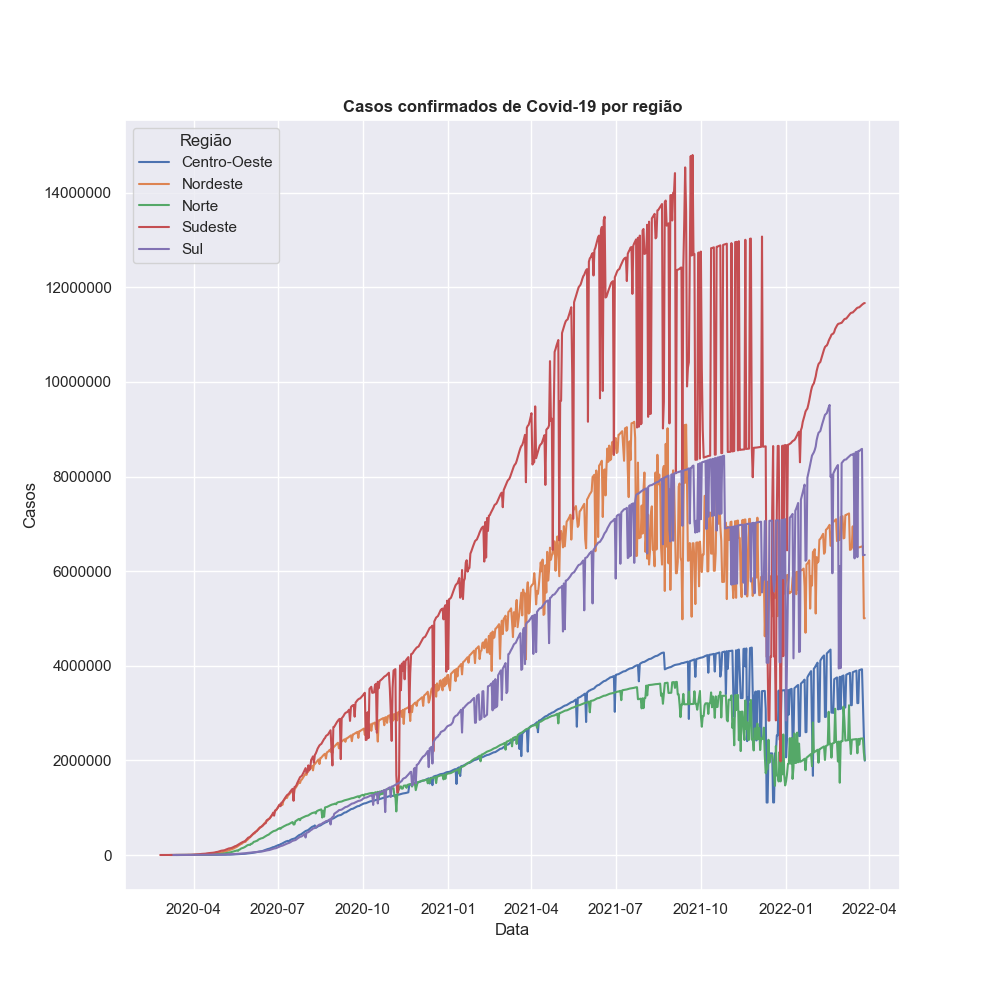

# covidPlot
Este projeto traça o número de casos de COVID-19 no Brasil por região de 2020 a 2022. 

O dataset utilizado pode ser encontrado em https://data.brasil.io/dataset/covid19/caso.csv.gz. 

As bibliotecas utilizadas são: pandas, matplotlib e seaborn.

</img>